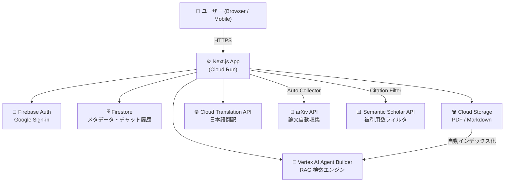

# 🌙 Tsukineko Grimoire（月ねこグリモワール）

> 知識を貪り、創造の魔法を紡ぐ、自分専用の魔導書

AI・機械学習論文を自動収集し、日本語で検索・質問できる RAG ベースの知識管理アプリ。  
Google Cloud "Trial credit for GenAI App Builder" ($1,000) を活用。

---

## ✨ 主な機能

| 機能 | 説明 |
|------|------|
| 🔮 **Grimoire（チャット）** | arXiv 論文を元に日本語で質問・回答（RAG） |
| 📚 **Archive（書庫）** | 収集済み論文の一覧表示・カテゴリ絞り込み・検索 |
| ⬆️ **Upload（取り込み）** | arXiv ID を最大10件一括登録 / PDF・Markdown を手動アップロード |
| 🛰️ **Auto Collector** | arXiv から AI/ML 論文を自動収集（被引用数フィルタ付き） |
| 🌐 **日本語翻訳** | タイトル・abstract を自動で日本語翻訳して保存 |
| 📄 **PDF→Markdown 変換** | 検索精度向上のため PDF をメタデータ注入型 Markdown に変換 |
| 🔍 **テキスト選択で深掘り** | 回答文を選択するとその箇所を即座に深掘り検索できる |
| 📎 **Citation Preview** | 引用番号クリックで論文の日本語要約・翻訳スニペット・図・実験表を表示 |
| 👤 **ゲストモード** | ログインなしでチャット・書庫の閲覧が可能（論文追加・設定はログイン必須） |

---

## 🏗️ システム構成



---

## 🛠️ Tech Stack

| 分類 | 技術 |
|------|------|
| **Frontend** | Next.js 14, TypeScript, Tailwind CSS, Framer Motion |
| **AI エンジン** | Vertex AI Agent Builder (`@google-cloud/discoveryengine`) |
| **認証** | Firebase Authentication（Google Sign-in + Session Cookie） |
| **データベース** | Firestore |
| **ストレージ** | Google Cloud Storage |
| **翻訳** | Cloud Translation API v2 |
| **論文情報** | arXiv API, Semantic Scholar API |
| **デプロイ** | Google Cloud Run |

---

## 🚀 セットアップ

### 1. 環境変数の設定

```bash
cp .env.example .env.local
# .env.local に各値を設定
```

### 2. Firebase の設定

1. [Firebase Console](https://console.firebase.google.com/) でプロジェクトを作成
2. Authentication → Google Sign-in を有効化
3. Firestore Database を作成（本番モード）
4. Web アプリを追加して設定値を `.env.local` に記載

### 3. Google Cloud の設定

```bash
# API の有効化
gcloud services enable \
  discoveryengine.googleapis.com \
  storage.googleapis.com \
  firestore.googleapis.com \
  translate.googleapis.com

# GCS バケット作成
gsutil mb -l asia-northeast1 gs://<your-bucket-name>

# サービスアカウント作成 & キー取得
gcloud iam service-accounts create grimoire-sa
gcloud projects add-iam-policy-binding <PROJECT_ID> \
  --member="serviceAccount:grimoire-sa@<PROJECT_ID>.iam.gserviceaccount.com" \
  --role="roles/owner"
gcloud iam service-accounts keys create keys/sa.json \
  --iam-account=grimoire-sa@<PROJECT_ID>.iam.gserviceaccount.com
```

### 4. Vertex AI Agent Builder の設定

1. [Agent Builder コンソール](https://console.cloud.google.com/gen-app-builder/engines) を開く
2. **Data Store** を作成（Type: Cloud Storage, Location: **global**）
3. 作成した GCS バケットを Data Store に接続
4. **Search App** を作成して Data Store を紐付け
5. Engine ID と Data Store ID を `.env.local` に記載（短い ID のみ）

### 5. 開発サーバーの起動

```bash
npm install

# macOS でファイル監視エラーが出る場合
WATCHPACK_POLLING=true npm run dev -- --port 3002
```

---

## 📖 API Routes

| エンドポイント | メソッド | 認証 | 説明 |
|--------------|---------|------|------|
| `/api/chat` | POST | 不要 | RAG チャット（Agent Builder 検索） |
| `/api/citation` | POST | 不要 | 引用論文の詳細取得（日本語要約・翻訳スニペット・リンク） |
| `/api/arxiv-preview` | GET | 不要 | arXiv メタデータ取得（登録なし・プレビュー用） |
| `/api/ingest` | POST | セッション | ファイルアップロード（PDF/Markdown） |
| `/api/collector` | POST | セッション or CRON | arXiv 論文収集（ID 直接指定はセッション認証可） |
| `/api/paper-figures` | GET | 不要 | arXiv HTML から代表図・実験表を抽出 |
| `/api/image-proxy` | GET | 不要 | arXiv 画像のプロキシ取得 |
| `/api/documents/check-status` | POST | セッション | pending 論文の Vertex AI インデックス状態を確認・更新 |
| `/api/auth/session` | POST/DELETE | - | セッション Cookie の発行・削除 |
| `/api/auth/me` | GET | セッション | セッションからユーザー情報を返す |
| `/api/admin/sync-status` | POST | CRON | Agent Builder インデックス状態を一括同期（全ユーザー） |
| `/api/admin/reindex` | POST | CRON | 既存 PDF を Markdown に変換して再インデックス |
| `/api/admin/translate-titles` | POST | CRON | 既存論文の titleJa を一括翻訳・補完 |

管理系 API（`/api/admin/*`）は `Authorization: Bearer <CRON_SECRET>` が必要です。

---

## 🗃️ データ収集

### 厳選論文リストから収集（推奨）

```bash
# タブ①: 開発サーバー起動
WATCHPACK_POLLING=true npm run dev -- --port 3002

# タブ②: 厳選論文を収集
bash scripts/curated-papers.sh 3002
```

`scripts/curated-ids.csv` に arXiv ID・タイトル・カテゴリが記載されており、67件の重要論文を直接 ID 指定で取得します。

### キーワードバッチ収集（被引用数フィルタ付き）

```bash
bash scripts/collect-papers.sh 3002
```

`MIN_CITATION_COUNT=50`（`.env.local`）未満の論文は自動スキップされます。

### Agent Builder インデックス更新

```bash
# 論文収集後（インデックス化に最大 48 時間かかります）
curl -X POST http://localhost:3002/api/admin/sync-status \
  -H "Authorization: Bearer local-dev-secret"
```

### 既存 PDF を Markdown に変換（検索精度向上）

```bash
for i in {1..8}; do
  curl -s -X POST http://localhost:3002/api/admin/reindex \
    -H "Authorization: Bearer local-dev-secret" \
    -H "Content-Type: application/json" \
    -d '{"limit": 10}'
  sleep 3
done
```

### 既存論文に日本語タイトルを一括追加

論文タイトルの日本語訳（`titleJa`）が未設定の論文を自動翻訳して Firestore に保存します。

```bash
# 30件ずつ実行（タイムアウト防止）。remaining が 0 になるまで繰り返す
curl -s -X POST "http://localhost:3002/api/admin/translate-titles?secret=local-dev-secret" \
  -H "Content-Type: application/json" \
  -d '{"batchLimit": 30}' | python3 -m json.tool
```

---

## 📁 プロジェクト構成

```
tsukineko-grimoire/
├── app/
│   ├── (auth)/login/           # ログインページ（ゲスト/ログイン機能比較）
│   ├── (main)/
│   │   ├── grimoire/           # RAG チャット画面（使い方ガイド付き初期表示）
│   │   ├── archive/            # 書庫（論文一覧・カテゴリ絞り込み・auto polling）
│   │   │   └── upload/         # アップロード（arXiv 一括登録 / その他文書）
│   │   └── settings/           # 設定・ログアウト
│   ├── api/
│   │   ├── chat/               # RAG チャット API（クエリタイプ検出・動的プロンプト）
│   │   ├── citation/           # 引用詳細 API（日本語要約・スニペット翻訳）
│   │   ├── arxiv-preview/      # arXiv メタデータ取得（登録なし）
│   │   ├── ingest/             # ファイルアップロード API
│   │   ├── collector/          # arXiv 自動収集 API（セッション認証 / CRON 両対応）
│   │   ├── paper-figures/      # arXiv HTML から代表図・実験表を抽出
│   │   ├── image-proxy/        # arXiv 画像プロキシ
│   │   ├── documents/
│   │   │   └── check-status/   # pending 論文の Vertex AI インデックス確認・更新
│   │   ├── admin/
│   │   │   ├── sync-status/    # インデックス状態一括同期（全ユーザー）
│   │   │   ├── reindex/        # PDF→Markdown 再変換
│   │   │   └── translate-titles/ # titleJa 一括翻訳（バックフィル）
│   │   └── auth/
│   │       ├── session/        # セッション Cookie 発行・削除
│   │       └── me/             # セッションからユーザー情報を返す
│   ├── icon.svg                # ファビコン（🌙 SVG）
│   └── page.tsx                # ランディングページ（マスコット・機能紹介）
├── components/
│   ├── features/
│   │   ├── chat-interface.tsx  # チャット UI（使い方ガイド・Citation Preview・Deep Dive）
│   │   ├── message-bubble.tsx  # メッセージ表示（Markdown・テキスト選択深掘り）
│   │   ├── archive-library.tsx # 書庫（pending auto polling 付き）
│   │   ├── file-uploader.tsx   # arXiv 一括登録（最大10件・2ステップ確認）
│   │   └── settings-panel.tsx  # 設定・ログアウト
│   └── main-nav.tsx            # ナビゲーション（ゲスト/ログイン状態で表示分岐）
├── lib/
│   ├── firebase-admin.ts       # Firebase Admin SDK
│   ├── firebase.ts             # Firebase Client SDK
│   ├── auth-helpers.ts         # 認証ヘルパー（x-session-token 検証）
│   ├── vertex-discovery.ts     # Agent Builder クライアント（シングルトン）
│   ├── translate.ts            # Cloud Translation API（JA↔EN）
│   ├── pdf-to-markdown.ts      # PDF→Markdown 変換（pdf-parse v2 クラス API 対応）
│   ├── html-to-markdown.ts     # arXiv HTML版→Markdown 変換（cheerio）
│   ├── semantic-scholar.ts     # 被引用数取得
│   └── query-cache.ts          # クエリキャッシュ
├── public/                     # 静的ファイル（マスコット画像等）
├── scripts/
│   ├── curated-ids.csv         # 厳選論文 ID リスト
│   ├── curated-papers.sh       # 厳選論文収集スクリプト
│   └── collect-papers.sh       # キーワードバッチ収集スクリプト
├── middleware.ts                # 認証ミドルウェア（ゲスト開放パス管理）
├── next.config.js              # COOP ヘッダー設定（Firebase popup 対応）
├── Dockerfile                  # Cloud Run 用
└── PRD.md                      # 完全仕様書
```

---

## 🚢 Cloud Run へのデプロイ

```bash
# Docker イメージをビルドして push
gcloud builds submit --tag gcr.io/<PROJECT_ID>/tsukineko-grimoire

# Cloud Run にデプロイ
gcloud run deploy tsukineko-grimoire \
  --image gcr.io/<PROJECT_ID>/tsukineko-grimoire \
  --region asia-northeast1 \
  --platform managed \
  --allow-unauthenticated \
  --set-env-vars "GOOGLE_CLOUD_PROJECT_ID=<PROJECT_ID>,..." \
  --set-secrets "FIREBASE_PRIVATE_KEY=firebase-private-key:latest"
```

シークレット類は [Secret Manager](https://console.cloud.google.com/security/secret-manager) で管理することを推奨します。

---

## 🧠 設計上の工夫と判断メモ

後から履歴を追えるよう、「なぜそうしたか」を記録しておく。

---

### 1. Citation Preview — モーダルからレスポンシブパネルへ

**判断**: 引用番号クリック時の表示をモーダルではなく「デスクトップ：右スライドパネル（幅をドラッグ調整可、最大 60%）」「モバイル：下からせり上がるシート」に変更。

**理由**: モーダルは読み進めながら比較できない。パネルであれば本文と並べて確認でき、論文を複数回クリックしながら読み進めるユースケースに合っている。幅調整は「論文の要約を長く読みたいか、チャットを優先したいか」がユーザーによって違うため。

---

### 2. テキスト選択「深掘り」機能

**判断**: 回答文の一部を選択すると「🔍 この部分を深掘り」ボタンが浮上し、クリックするとその語句だけを Agent Builder へ送信して新しい質問を生成。選択範囲には黄色のアンバー色ハイライト（`selection:bg-amber-400/25`）を付与。

**理由**: 「続けて」のような曖昧なフォローアップは RAG と相性が悪い（どの文脈を引き継ぐか特定できない）。「今読んでいる文章の中で気になった箇所をすぐ検索できる」という UX にすることで、ユーザーが意図を明示しやすくなる。

**技術的なポイント**: `window.getSelection()` で取得したテキストをそのまま Agent Builder に渡すと、自然言語的なフレーズがノイズになる。そのため選択したキーワードのみを検索クエリとし、表示上のメッセージ（「〇〇についてもっと詳しく教えてください」）と実際の検索クエリを分離している。

---

### 3. IME 変換中のエンター送信防止

**判断**: `e.nativeEvent.isComposing` が `true` の間は Enter を押しても送信しない。

**理由**: 日本語 IME で変換候補を選ぶ際に Enter を押すと、そのまま送信されてしまう問題があった。`isComposing` フラグで確定操作と送信操作を区別する。

---

### 4. 動的クエリタイプ検出と応答テンプレートの切り替え

**判断**: ユーザーの質問を 6 種（`overview` / `definition` / `mechanism` / `comparison` / `practical` / `research`）に自動分類し、それぞれに最適化した Markdown テンプレートを Agent Builder の `modelPromptSpec.preamble` に適用。`pageSize` / `summaryResultCount` も動的に変える。

**理由**: 「〜とは？」と「〜の仕組みは？」は知りたいことの粒度が違う。画一的な構造でまとめると、不要なセクションが「情報がありません」で埋まるか、同じことが繰り返されやすい。クエリタイプごとに「必要な見出し」だけを定義することで、余分なセクションを完全に省略できる。

**もう一つの理由（コスト）**: `summaryResultCount` をタイプ別に調整することで、単純な定義質問に 5 件も引かずに済む。

---

### 5. プロンプトを英語で書き、回答は日本語で要求

**判断**: Agent Builder の `preamble` はすべて英語で書き、末尾に「Respond in Japanese」と明示。

**理由**: preamble に日本語を混在させると、Agent Builder が英語の検索結果要約と日本語の指示を交互に処理することになり、出力の自然さが下がる。英語→英語でコンテキストを組み立てた後、日本語出力を要求する方が翻訳品質が安定した。

---

### 6. 会話履歴から AI の日本語応答を除外

**判断**: 会話コンテキストを Agent Builder に渡す際、ユーザーの英語訳クエリのみを含め、AI の前回の日本語応答は含めない（`userOnlyContext`）。

**理由**: AI の日本語応答をそのまま次のクエリのコンテキストとして渡すと、Agent Builder の内部で英語・日本語が混在してしまい、英語の検索インデックスとの整合性が崩れる。純粋にユーザーの意図（英語化したもの）だけを引き継ぐことで言語の汚染を防ぐ。

---

### 7. 結果なし時のフォールバック UI

**判断**: Agent Builder が結果を返せなかった場合、正直に「この知識ベースには情報がない」と伝え、関連論文が見つかれば最大 3 件を提示する。テンプレートのサジェスト（「〜とは？」など）は削除した。

**理由**: 架空の代替クエリを提示すると、ユーザーが「情報はある、ただ聞き方が悪かっただけ」と誤解しやすい。存在しない情報を探させるのは不誠実であるため、正直にスコープ（AI/ML arXiv 論文）を伝え、本当に関連する文書がある場合のみ提示する設計に変更した。

---

### 8. `titleJa`（日本語タイトル）の Firestore 管理

**判断**: 論文の日本語タイトルを `titleJa` フィールドとして Firestore に保存し、新規収集時・手動アップロード時に自動生成。既存論文には管理者 API（`/api/admin/translate-titles`）でバックフィル。

**理由**: Archive（書庫）やフォールバック時の関連論文サジェスト表示において、英語タイトルだけだと日本語ユーザーには読みにくい。翻訳コストを最小化するため、一度翻訳した値を Firestore にキャッシュして再翻訳しない設計にしている。

---

### 9. Citation Preview の情報設計

**判断**:
- 日本語タイトル（`titleJa`）を主タイトル、英語タイトルを副題として並記
- 引用スニペットの HTML タグ（`<b>` など）を除去して表示
- 論文概要（`summaryJa`）を `ReactMarkdown` ＋ 独自段落分割でレンダリング
- 「この論文についてグリモワールに聞く」ボタンをパネル最下部に配置

**理由**: 機械翻訳の日本語タイトルは誤訳がありうるため、英語タイトルを参照できるようにする。Agent Builder が返すスニペットには強調用の HTML が含まれるが、ここでは不要なので除去する。概要は長文になりがちで、プレーンテキストのままだと読みにくいため、「。」区切りで段落を生成してマークダウンとして描画する。「グリモワールに聞く」は補助的なアクションであるため、主情報（タイトル・スニペット・概要）を閲覧した後に自然に目に入るパネル下部が適切。

---

### 10. チャット回答へのインライン引用番号 `[N]` の挿入

**判断**: Agent Builder の `summarySpec` に `includeCitations: true` を追加し、回答文に `[1]`, `[2]` などのマーカーを自動挿入させる。フロントエンドの `injectCitations` ヘルパーがマーカーをクリッカブルボタンに変換し、クリックで Citation Preview を開く。

**理由**: 回答文中のどの記述がどの論文に由来するのかが不明だと、信頼性・検証可能性が低い。Agent Builder のネイティブ機能（`includeCitations`）を活用することで実装コストを最小化しつつ、根拠の透明性を確保する。

---

### 11. 引用論文の発行年表示と時系列サマリー

**判断**: 引用バッジに発行年（例「GraphRAG · 2024」）を付記し、回答全体の参照年範囲（「📅 この回答は 2022年〜2024年の論文 5 件に基づいています」）を表示する。年は Firestore の `publishedAt` を優先し、なければ `arxivId` の先頭 2 桁から推定する。

**理由**: RAG ベースのシステムでは「いつの情報か」がユーザーにとって非常に重要。特に技術進化の速い AI/ML 分野では、2022 年の論文と 2024 年の論文では内容が大きく異なる場合がある。追加的な API コールなしに `arxivId` から年を推定できるため、フォールバックとして活用する。

---

### 12. Archive 書庫の検索精度改善

**判断**: デフォルトの検索対象を「タイトル（英日両方）」に絞り、「詳細検索」トグルをオンにした場合のみ要約・著者も検索する。

**理由**: "RAG" のような汎用的なキーワードで全文検索すると、タイトルに含まれない論文（アブストラクトで RAG に言及しているだけ）が大量ヒットして本当に探したい論文が埋もれてしまう。タイトル検索を基本とすることで「その論文が主に扱っているテーマ」での絞り込みになり、ノイズを大幅に減らせる。要約まで広げたい場合はトグルで明示的に切り替えられるため、UX の柔軟性も損なわない。

---

### 13. アップロード UI の刷新（arXiv ID 入力 + 独自文書フォーム）

**判断**: アップロードページをタブ切り替え型に刷新した。
- **arXiv 論文タブ（デフォルト）**: arXiv ID または URL を入力するだけで取り込み完了。PDF をローカルにダウンロードする必要がなくなった。既存の `collector/route.ts`（`handleSingleById`）を流用。
- **その他の文書タブ**: PDF / Markdown ドロップゾーンに加え、タイトル（英/日）・文書種別（論文 / 技術レポート / 社内資料 / 議事録 / その他）・著者・作成日・概要・タグのメタデータフォームを用意。

**理由**: HTML 優先インデックスへの切り替えにより PDF ファイル自体が不要になったため、arXiv 論文については ID 入力だけで完結させる方が自然。一方で arXiv 外の独自文書・社内資料も取り込める拡張性を残すため、タブで明示的に分岐させる設計にした。文書種別やタグを Firestore に保存することで、後から Archive で検索・分類しやすくなる。

---

### 14. Archive DocCard への文書種別バッジ追加

**判断**: arXiv 論文には緑の `arXiv:XXXX` バッジ（リンク付き）、独自文書には文書種別に応じた色分けバッジ（論文:青、技術レポート:水色、社内資料:オレンジ、議事録:黄色）を表示。タグは `#タグ名` のグレーバッジで一覧表示。

**理由**: arXiv メインのアプリに非 arXiv 文書が混在するようになったため、ひと目で出所がわかるビジュアル区別が必要。色分けにより「この文書は社内資料」などが即座に判断できる。

---

### 15. arXiv HTML 版を優先インデックス（PDF フォールバック付き）

**判断**: 論文の Markdown 生成において `https://arxiv.org/html/{arxivId}` を優先取得し、HTML 版が存在しない場合のみ PDF テキスト抽出（`pdf-parse`）にフォールバックする。新規収集（`collector`）・手動アップロード（`ingest`）・既存論文の再インデックス（`admin/reindex`）すべてで同じ方針を適用。過去分は `/api/admin/reindex` に `mode=html` オプションを追加して一括アップグレード可能。処理済みフラグ（`htmlIndexed: 'html' | 'pdf'`）を Firestore に保存し、重複処理を防ぐ。

**理由**: PDF テキスト抽出（`pdf-parse`）には以下の限界がある：
- LaTeX → PDF の変換で数式が文字化けする
- 2段組レイアウトで左右の文が混在する
- セクション見出しが本文と区別できない

arXiv HTML 版（2022年以降の論文で広くカバー）は LaTeX ソースから直接生成されるため、セクション構造・数式（alttext として LaTeX 保持）・著者情報が正確に取れる。`cheerio` で本文を抽出し、既存の Markdown ヘッダー（日本語概要・Abstract）を先頭に付与して GCS に保存することで、Agent Builder の検索精度が向上する。HTML 版がない古い論文は PDF にフォールバックするため、後方互換性を損なわない。

また、`pdf-parse` のメジャーバージョンアップ（v1 関数 API → v2 クラス `PDFParse` API）への対応も同時に実施した。

---

### 16. ゲストモードと認証フロー設計

**判断**: ログインなしでもチャット（`/grimoire`）と書庫閲覧（`/archive`）を利用可能にし、論文追加（`/archive/upload`）と設定（`/settings`）はログイン必須とした。

**理由**: 「まず使ってみてから登録するか決めたい」というユーザー摩擦を減らすため。ゲストでも主要機能を試せることで、ログインの価値（論文追加・将来のブックマーク等）を実感してから登録判断できる。

**技術的なポイント**: Firebase `signInWithPopup` が `Cross-Origin-Opener-Policy` ヘッダーと競合してポップアップ通信ができない問題を、`next.config.js` で `same-origin-allow-popups` を設定して解決。セッションクッキーが middleware を経由せずに届かないパス（公開パス）では、コンポーネント側が `/api/auth/me` にフォールバック検証する。

---

### 17. arXiv 論文の2ステップ確認登録（最大10件一括）

**判断**: arXiv ID の登録を「検索（プレビュー）→ 確認 → 登録」の2ステップにし、最大10件を一括登録できるようにした。

**理由**: ID を入力して即登録だと「本当にこれか？」の確認ができない。プレビュー段階で論文の存在確認・タイトル・著者・要約を表示することで、誤登録や重複登録を事前に防げる。複数件一括入力は、関連論文をまとめて登録するユースケース（論文サーベイ時など）を想定。

**エラー分類**: 形式不正（⚠️ 橙）・論文未存在（🔍 赤）・取得失敗（⚠️ 赤）・登録済み（✅ グレー）を明確に区別し、ユーザーが次のアクションを判断しやすくした。

---

### 18. Firestore ステータスの自動ポーリング

**判断**: `/archive` を開いている間、`pending` 状態の論文があれば10分ごとに `/api/documents/check-status` を自動実行し、Vertex AI Search に反映済みであれば `indexed` に更新する。

**理由**: インデックス化には最大48時間かかるため、手動で状態を確認・更新する運用は現実的でない。Firestore のリアルタイムリスナーが既に実装済みであるため、ポーリングで Firestore を更新すれば UI は自動的に追従する。

---

## ⚠️ 重要な制約

このプロジェクトは **Vertex AI Agent Builder（Discovery Engine API）のみ** を AI エンジンとして使用します。

```typescript
// ✅ 使用可
import { SearchServiceClient } from '@google-cloud/discoveryengine';

// ❌ 使用禁止（高額請求の原因になる）
import { VertexAI } from '@google-cloud/vertexai';
```

詳細は `.cursorrules` および `PRD.md` を参照してください。
