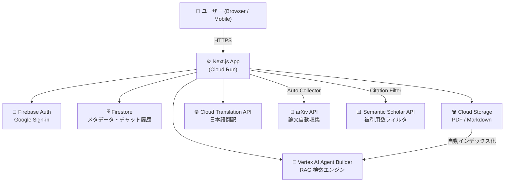

# 🌙 Tsukineko Grimoire（月ねこグリモワール）

> 知識を貪り、創造の魔法を紡ぐ、自分専用の魔導書

AI・機械学習論文を自動収集し、日本語で検索・質問できる RAG ベースの知識管理アプリ。  
Google Cloud "Trial credit for GenAI App Builder" ($1,000) を活用。

---

## ✨ 主な機能

| 機能 | 説明 |
|------|------|
| 🔮 **Grimoire（チャット）** | arXiv 論文を元に日本語で質問・回答（RAG） |
| 📚 **Archive（書庫）** | 収集済み論文の一覧表示・カテゴリ絞り込み・検索 |
| ⬆️ **Upload（取り込み）** | PDF・Markdown を手動アップロード |
| 🛰️ **Auto Collector** | arXiv から AI/ML 論文を自動収集（被引用数フィルタ付き） |
| 🌐 **日本語翻訳** | タイトル・abstract を自動で日本語翻訳して保存 |
| 📄 **PDF→Markdown 変換** | 検索精度向上のため PDF をメタデータ注入型 Markdown に変換 |
| 🔍 **テキスト選択で深掘り** | 回答文を選択するとその箇所を即座に深掘り検索できる |
| 📎 **Citation Preview** | 引用番号クリックで論文の日本語要約・翻訳スニペット・各種リンクを表示 |

---

## 🏗️ システム構成



---

## 🛠️ Tech Stack

| 分類 | 技術 |
|------|------|
| **Frontend** | Next.js 14, TypeScript, Tailwind CSS, Framer Motion |
| **AI エンジン** | Vertex AI Agent Builder (`@google-cloud/discoveryengine`) |
| **認証** | Firebase Authentication（Google Sign-in + Session Cookie） |
| **データベース** | Firestore |
| **ストレージ** | Google Cloud Storage |
| **翻訳** | Cloud Translation API v2 |
| **論文情報** | arXiv API, Semantic Scholar API |
| **デプロイ** | Google Cloud Run |

---

## 🚀 セットアップ

### 1. 環境変数の設定

```bash
cp .env.example .env.local
# .env.local に各値を設定
```

### 2. Firebase の設定

1. [Firebase Console](https://console.firebase.google.com/) でプロジェクトを作成
2. Authentication → Google Sign-in を有効化
3. Firestore Database を作成（本番モード）
4. Web アプリを追加して設定値を `.env.local` に記載

### 3. Google Cloud の設定

```bash
# API の有効化
gcloud services enable \
  discoveryengine.googleapis.com \
  storage.googleapis.com \
  firestore.googleapis.com \
  translate.googleapis.com

# GCS バケット作成
gsutil mb -l asia-northeast1 gs://<your-bucket-name>

# サービスアカウント作成 & キー取得
gcloud iam service-accounts create grimoire-sa
gcloud projects add-iam-policy-binding <PROJECT_ID> \
  --member="serviceAccount:grimoire-sa@<PROJECT_ID>.iam.gserviceaccount.com" \
  --role="roles/owner"
gcloud iam service-accounts keys create keys/sa.json \
  --iam-account=grimoire-sa@<PROJECT_ID>.iam.gserviceaccount.com
```

### 4. Vertex AI Agent Builder の設定

1. [Agent Builder コンソール](https://console.cloud.google.com/gen-app-builder/engines) を開く
2. **Data Store** を作成（Type: Cloud Storage, Location: **global**）
3. 作成した GCS バケットを Data Store に接続
4. **Search App** を作成して Data Store を紐付け
5. Engine ID と Data Store ID を `.env.local` に記載（短い ID のみ）

### 5. 開発サーバーの起動

```bash
npm install

# macOS でファイル監視エラーが出る場合
WATCHPACK_POLLING=true npm run dev -- --port 3002
```

---

## 📖 API Routes

| エンドポイント | メソッド | 説明 |
|--------------|---------|------|
| `/api/chat` | POST | RAG チャット（Agent Builder 検索） |
| `/api/citation` | POST | 引用論文の詳細取得（日本語要約・翻訳スニペット・リンク） |
| `/api/ingest` | POST | ファイルアップロード（PDF/Markdown） |
| `/api/collector` | POST | arXiv 論文自動収集 |
| `/api/admin/sync-status` | POST | Agent Builder インデックス状態を同期 |
| `/api/admin/reindex` | POST | 既存 PDF を Markdown に変換して再インデックス |
| `/api/admin/translate-titles` | POST | 既存論文の titleJa を一括翻訳・補完 |
| `/api/auth/session` | POST/DELETE | セッション Cookie の発行・削除 |

管理系 API は `Authorization: Bearer <CRON_SECRET>` が必要です。

---

## 🗃️ データ収集

### 厳選論文リストから収集（推奨）

```bash
# タブ①: 開発サーバー起動
WATCHPACK_POLLING=true npm run dev -- --port 3002

# タブ②: 厳選論文を収集
bash scripts/curated-papers.sh 3002
```

`scripts/curated-ids.csv` に arXiv ID・タイトル・カテゴリが記載されており、67件の重要論文を直接 ID 指定で取得します。

### キーワードバッチ収集（被引用数フィルタ付き）

```bash
bash scripts/collect-papers.sh 3002
```

`MIN_CITATION_COUNT=50`（`.env.local`）未満の論文は自動スキップされます。

### Agent Builder インデックス更新

```bash
# 論文収集後（インデックス化に最大 48 時間かかります）
curl -X POST http://localhost:3002/api/admin/sync-status \
  -H "Authorization: Bearer local-dev-secret"
```

### 既存 PDF を Markdown に変換（検索精度向上）

```bash
for i in {1..8}; do
  curl -s -X POST http://localhost:3002/api/admin/reindex \
    -H "Authorization: Bearer local-dev-secret" \
    -H "Content-Type: application/json" \
    -d '{"limit": 10}'
  sleep 3
done
```

### 既存論文に日本語タイトルを一括追加

論文タイトルの日本語訳（`titleJa`）が未設定の論文を自動翻訳して Firestore に保存します。

```bash
# 30件ずつ実行（タイムアウト防止）。remaining が 0 になるまで繰り返す
curl -s -X POST "http://localhost:3002/api/admin/translate-titles?secret=local-dev-secret" \
  -H "Content-Type: application/json" \
  -d '{"batchLimit": 30}' | python3 -m json.tool
```

---

## 📁 プロジェクト構成

```
tsukineko-grimoire/
├── app/
│   ├── (auth)/login/           # ログインページ
│   ├── (main)/
│   │   ├── grimoire/           # RAG チャット画面
│   │   ├── archive/            # 書庫（論文一覧・検索）
│   │   │   └── upload/         # アップロードページ
│   │   └── settings/           # 設定ページ
│   └── api/
│       ├── chat/               # RAG チャット API（クエリタイプ検出・動的プロンプト）
│       ├── citation/           # 引用詳細 API（日本語要約・スニペット翻訳）
│       ├── ingest/             # ファイルアップロード API（titleJa 自動翻訳）
│       ├── collector/          # arXiv 自動収集 API（titleJa 自動翻訳）
│       ├── admin/
│       │   ├── sync-status/    # インデックス状態同期
│       │   ├── reindex/        # PDF→Markdown 再変換
│       │   └── translate-titles/ # titleJa 一括翻訳（バックフィル）
│       └── auth/session/       # 認証セッション
├── components/
│   ├── features/
│   │   ├── chat-interface.tsx  # チャット UI（レスポンシブ Citation Preview・Deep Dive）
│   │   ├── message-bubble.tsx  # メッセージ表示（Markdown・テキスト選択深掘り）
│   │   ├── archive-library.tsx # 書庫コンポーネント
│   │   └── file-uploader.tsx   # アップロードコンポーネント
│   └── main-nav.tsx            # ナビゲーション（モバイル対応）
├── lib/
│   ├── firebase-admin.ts       # Firebase Admin SDK
│   ├── firebase.ts             # Firebase Client SDK
│   ├── auth-helpers.ts         # 認証ヘルパー
│   ├── vertex-discovery.ts     # Agent Builder クライアント（シングルトン）
│   ├── translate.ts            # Cloud Translation API（JA↔EN）
│   ├── pdf-to-markdown.ts      # PDF→Markdown 変換
│   ├── semantic-scholar.ts     # 被引用数取得
│   └── query-cache.ts          # クエリキャッシュ
├── scripts/
│   ├── curated-ids.csv         # 厳選論文 ID リスト（67件）
│   ├── curated-papers.sh       # 厳選論文収集スクリプト
│   └── collect-papers.sh       # キーワードバッチ収集スクリプト
├── middleware.ts                # 認証ミドルウェア
├── Dockerfile                  # Cloud Run 用
└── PRD.md                      # 完全仕様書
```

---

## 🚢 Cloud Run へのデプロイ

```bash
# Docker イメージをビルドして push
gcloud builds submit --tag gcr.io/<PROJECT_ID>/tsukineko-grimoire

# Cloud Run にデプロイ
gcloud run deploy tsukineko-grimoire \
  --image gcr.io/<PROJECT_ID>/tsukineko-grimoire \
  --region asia-northeast1 \
  --platform managed \
  --allow-unauthenticated \
  --set-env-vars "GOOGLE_CLOUD_PROJECT_ID=<PROJECT_ID>,..." \
  --set-secrets "FIREBASE_PRIVATE_KEY=firebase-private-key:latest"
```

シークレット類は [Secret Manager](https://console.cloud.google.com/security/secret-manager) で管理することを推奨します。

---

## 🧠 設計上の工夫と判断メモ

後から履歴を追えるよう、「なぜそうしたか」を記録しておく。

---

### 1. Citation Preview — モーダルからレスポンシブパネルへ

**判断**: 引用番号クリック時の表示をモーダルではなく「デスクトップ：右スライドパネル（幅をドラッグ調整可、最大 60%）」「モバイル：下からせり上がるシート」に変更。

**理由**: モーダルは読み進めながら比較できない。パネルであれば本文と並べて確認でき、論文を複数回クリックしながら読み進めるユースケースに合っている。幅調整は「論文の要約を長く読みたいか、チャットを優先したいか」がユーザーによって違うため。

---

### 2. テキスト選択「深掘り」機能

**判断**: 回答文の一部を選択すると「🔍 この部分を深掘り」ボタンが浮上し、クリックするとその語句だけを Agent Builder へ送信して新しい質問を生成。選択範囲には黄色のアンバー色ハイライト（`selection:bg-amber-400/25`）を付与。

**理由**: 「続けて」のような曖昧なフォローアップは RAG と相性が悪い（どの文脈を引き継ぐか特定できない）。「今読んでいる文章の中で気になった箇所をすぐ検索できる」という UX にすることで、ユーザーが意図を明示しやすくなる。

**技術的なポイント**: `window.getSelection()` で取得したテキストをそのまま Agent Builder に渡すと、自然言語的なフレーズがノイズになる。そのため選択したキーワードのみを検索クエリとし、表示上のメッセージ（「〇〇についてもっと詳しく教えてください」）と実際の検索クエリを分離している。

---

### 3. IME 変換中のエンター送信防止

**判断**: `e.nativeEvent.isComposing` が `true` の間は Enter を押しても送信しない。

**理由**: 日本語 IME で変換候補を選ぶ際に Enter を押すと、そのまま送信されてしまう問題があった。`isComposing` フラグで確定操作と送信操作を区別する。

---

### 4. 動的クエリタイプ検出と応答テンプレートの切り替え

**判断**: ユーザーの質問を 6 種（`overview` / `definition` / `mechanism` / `comparison` / `practical` / `research`）に自動分類し、それぞれに最適化した Markdown テンプレートを Agent Builder の `modelPromptSpec.preamble` に適用。`pageSize` / `summaryResultCount` も動的に変える。

**理由**: 「〜とは？」と「〜の仕組みは？」は知りたいことの粒度が違う。画一的な構造でまとめると、不要なセクションが「情報がありません」で埋まるか、同じことが繰り返されやすい。クエリタイプごとに「必要な見出し」だけを定義することで、余分なセクションを完全に省略できる。

**もう一つの理由（コスト）**: `summaryResultCount` をタイプ別に調整することで、単純な定義質問に 5 件も引かずに済む。

---

### 5. プロンプトを英語で書き、回答は日本語で要求

**判断**: Agent Builder の `preamble` はすべて英語で書き、末尾に「Respond in Japanese」と明示。

**理由**: preamble に日本語を混在させると、Agent Builder が英語の検索結果要約と日本語の指示を交互に処理することになり、出力の自然さが下がる。英語→英語でコンテキストを組み立てた後、日本語出力を要求する方が翻訳品質が安定した。

---

### 6. 会話履歴から AI の日本語応答を除外

**判断**: 会話コンテキストを Agent Builder に渡す際、ユーザーの英語訳クエリのみを含め、AI の前回の日本語応答は含めない（`userOnlyContext`）。

**理由**: AI の日本語応答をそのまま次のクエリのコンテキストとして渡すと、Agent Builder の内部で英語・日本語が混在してしまい、英語の検索インデックスとの整合性が崩れる。純粋にユーザーの意図（英語化したもの）だけを引き継ぐことで言語の汚染を防ぐ。

---

### 7. 結果なし時のフォールバック UI

**判断**: Agent Builder が結果を返せなかった場合、「こんな聞き方はどうですか？」というテンプレートリスト（クリック可能）と、Firestore から関連論文を最大 3 件表示する。

**理由**: 「結果が見つかりませんでした。検索語句を修正してください。」はユーザーを迷わせるだけ。具体的な代替クエリを提示し、しかもクリックで即座に再検索できれば、ユーザーは次の行動を取れる。テンプレートは実際の知識ベースに紐づいているわけではないが、一般的な切り口（「〜とは？」「〜はどのように機能するか？」）を提示することで発見を促せる。

---

### 8. `titleJa`（日本語タイトル）の Firestore 管理

**判断**: 論文の日本語タイトルを `titleJa` フィールドとして Firestore に保存し、新規収集時・手動アップロード時に自動生成。既存論文には管理者 API（`/api/admin/translate-titles`）でバックフィル。

**理由**: Archive（書庫）やフォールバック時の関連論文サジェスト表示において、英語タイトルだけだと日本語ユーザーには読みにくい。翻訳コストを最小化するため、一度翻訳した値を Firestore にキャッシュして再翻訳しない設計にしている。

---

## ⚠️ 重要な制約

このプロジェクトは **Vertex AI Agent Builder（Discovery Engine API）のみ** を AI エンジンとして使用します。

```typescript
// ✅ 使用可
import { SearchServiceClient } from '@google-cloud/discoveryengine';

// ❌ 使用禁止（高額請求の原因になる）
import { VertexAI } from '@google-cloud/vertexai';
```

詳細は `.cursorrules` および `PRD.md` を参照してください。
